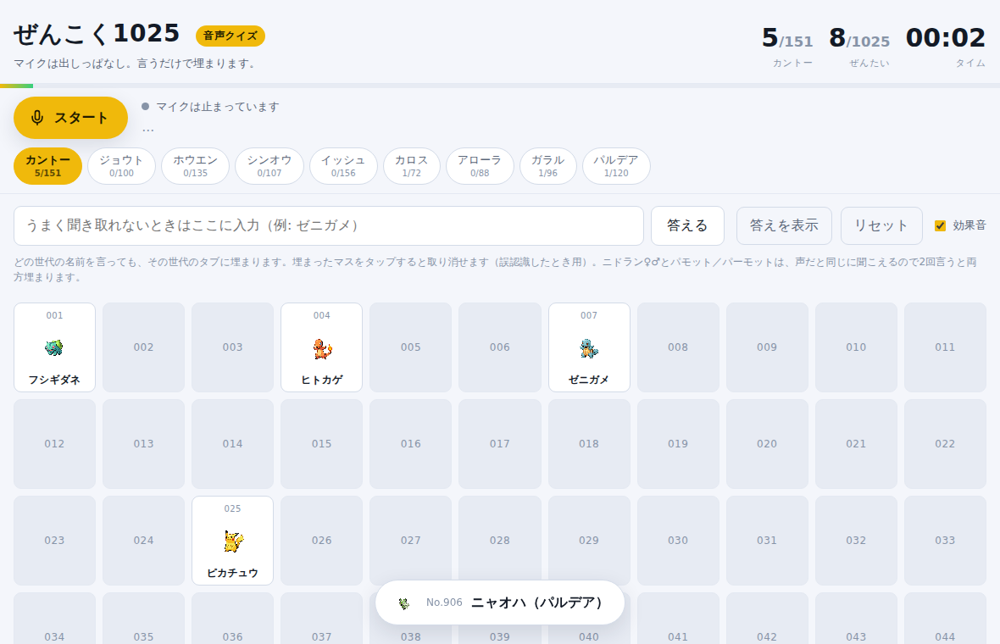

# ぜんこく1025 音声クイズ

第1〜第9世代のポケモン1025匹を**声で言うだけ**で図鑑が埋まっていくクイズです。
`all-pokemon-ierukana.com` のような「全ポケモン言えるかな」を、タイピングではなく
音声入力でやるために作りました。

マイクは押しっぱなし・出しっぱなし。思いついた順に名前を言っていくだけで、
当たったマスが次々に埋まっていきます。1回の発話に何匹入っていても構いません。

漢字で返ってきても拾います。音声認識は「エビワラー」を「海老原」、「サワムラー」を
「沢村」のように漢字へ変換してしまいますが、KANJIDIC2 の読み（名乗り読みを含む）で
読みに戻してから照合するので、別名を1件ずつ手で足さなくても大半は拾えます。

世代ごとにタブが分かれていますが、**聞き取りの対象は常に全1025匹**です。
カントーを表示したままパルデアの名前を言っても、ちゃんとパルデアのタブに埋まります
（どこに入ったかはトーストで知らせます）。タブを切り替えながら喋る必要はありません。



## 使いかた

音声認識（Web Speech API）は **HTTPS か localhost でしか動きません**。
HTML ファイルをダブルクリックして開くとマイクが使えないので、どちらかの方法で開いてください。

### A. ローカルで動かす（すぐ試す）

```sh
git clone https://github.com/tiida-rgb/others.git
cd others/pokemon-voice-quiz
python3 -m http.server 8000
```

ブラウザで <http://localhost:8000/> を開く。

### B. GitHub Pages に置く（スマホからも遊べる）

1. GitHub のリポジトリ → **Settings** → **Pages**
2. Source を **Deploy from a branch**、ブランチをこのブランチ、フォルダを **/(root)** にして Save
3. 数分後に `https://tiida-rgb.github.io/others/pokemon-voice-quiz/` で開ける

スマホの Chrome から開けば、寝転がりながら声だけで遊べます。

> **ブラウザ**: 音声認識は Chrome / Edge（PC・Android）で動きます。
> Safari と Firefox は Web Speech API の音声認識に未対応なので、下の入力欄から手入力で遊べます。

## 遊びかた

| したいこと | やりかた |
| --- | --- |
| 答える | スタートを押して、あとは名前を言うだけ |
| まとめて答える | 「ピカチュウ ライチュウ カイリュー」と続けて言ってもOK |
| 聞き取ってもらえない | 下の入力欄に打ち込む |
| 誤認識を取り消す | 埋まったマスをタップ／クリック |
| ニドラン♀♂ | 「ニドラン」と2回言うと♀→♂の順に埋まる |
| 中断する | ストップを押すとタイマーも止まる。進捗はブラウザに保存される |
| 答え合わせ | 「答えを表示」で、まだ言えていない子の名前が出る |

## 聞き取りのしくみ

日本語の音声認識は、カタカナの固有名詞をそのまま返してくれるとは限りません。
「フシギダネ」が `不思議だね`、「ゼニガメ」が `銭亀`、「キュウコン」が `球根` になります。
そこで `matcher.js` が3段構えで拾います。

1. **strict** — 長音・中黒・記号だけ落としたキーで完全一致。
   連続した発話（`ピカチュウライチュウ`）も左から貪欲に切り出します。
   よくある漢字・ひらがな表記は `data.js` の `aliases` に持たせてあります。
2. **loose** — 濁点・半濁点・小書き・促音まで潰したキーで完全一致。
   `ウィンディ` と `ウインディ` のような揺れを吸収します。
3. **fuzzy** — loose キーに対して編集距離1まで許容。
   `ピカチュー`→`ピカチュウ` のような1文字の取りこぼしを拾います。
4. **kanji** — 漢字が混じっていたら `kanji-readings.js` の表で読みに戻し、1〜2 に流します。
   `海老原`→`エビワラ`→**エビワラー**、`闇カラス`→**ヤミカラス** のように、
   別名を手で足していない漢字変換も拾えます。1025匹ぶんの変換候補を人間が
   書き切るのは無理なので、こちらが本命です。

誤爆を避けるための線引きも入れてあります。

- `カラカラ` と `ガラガラ` は loose だと同じキーに潰れるので、この2匹は濁点まで一致したときだけ埋めます。
- `リザード` / `リザードン`、`プリン` / `プクリン` のような短くて紛らわしい名前は、あいまい一致の対象外（5文字未満）です。
- 漢字から戻した読みには fuzzy を使いません。名乗り読みまで含めると漢字の読みは非常に緩く、
  手書きの漢字別名70件と普通の熟語104語で測ると `strict+loose` が 効き目87% / 誤爆2%、
  fuzzy まで許すと 効き目99% / 誤爆13%（`風鈴`→`プリン`、`土竜`→`ドリュウズ`）で割に合いません。
  同じ理由で、漢字から戻した読みは4モーラ以上のときだけ採用します。
  ここで取りこぼすもの（`兜`、`三度`、`稀コイル` など）は `data.js` の別名で補います。
- `ゴース`（→「ゴス」）のような2文字以下のキーは、発話まるごとがそのキーのときだけ拾います。
  そうしないと「消して」が `ケーシィ` に化けます。
- 認識の候補は第5候補まで全部試します。カタカナの正解が第2候補以降に入っていることがよくあるためです。

うまくいかない発話があったら「聞き取りログ」を開くと、**何と認識されたか**が残っています。
そこに出ている表記を `data.js` の `aliases` に足せば、次からは拾えるようになります。

## ファイル

| ファイル | 中身 |
| --- | --- |
| `index.html` | 画面 |
| `style.css` | 見た目（ダーク／ライト自動切り替え、スマホ対応） |
| `data.js` | 1025匹の名前・世代・別名表記（`build-data.mjs` が生成） |
| `kanji-readings.js` | 漢字→読みの表（`build-readings.mjs` が生成） |
| `matcher.js` | 認識テキスト → ポケモン の判定。ここが本体 |
| `app.js` | 音声認識の制御、図鑑の描画、保存、タイマー |
| `test-matcher.js` | 判定ロジックの回帰テスト（Node だけで動く） |
| `test-browser.mjs` | 画面まわりの回帰テスト（任意・Playwright が要る） |
| `build-data.mjs` | `data.js` を PokeAPI の CSV から作り直す（手書きの別名は残る） |
| `build-readings.mjs` | `kanji-readings.js` を KANJIDIC2 から作り直す |
| `fetch-sprites.sh` | ポケモン画像をローカルに落とす（任意・オフライン用） |

画像は既定では PokeAPI の CDN から読み込みます。`./fetch-sprites.sh` を実行すると
`sprites/` に落としてオフラインでも表示されます（リポジトリには含めていません）。
画像が出なくても名前だけで普通に遊べます。

## テスト

```sh
node test-matcher.js
```

1025匹すべての正式名称と別名が正しく解決するか、想定外のキー衝突が起きていないか、
普通の日本語（「えーと」「消して」「今日はいい天気ですね」）で誤爆しないかを確認します。

画面まわりまで通しで見たいときは、偽の音声認識エンジンを差し込んで動かすテストもあります。

```sh
npm i playwright && npx playwright install chromium
python3 -m http.server 8000 &
node test-browser.mjs
```

マイクの自動再開、認識結果が図鑑に反映されること、誤認識の取り消し、進捗の保存、
スマホ幅で名前が欠けないことなどを確認します。

## 出典

ポケモン名データは [PokeAPI](https://github.com/PokeAPI/pokeapi)（`pokemon_species_names.csv`）、
画像は [PokeAPI/sprites](https://github.com/PokeAPI/sprites) から取得しています。

漢字の読み（`kanji-readings.js`）は [KANJIDIC2](https://www.edrdg.org/wiki/index.php/KANJIDIC_Project) から
生成しています。KANJIDIC2 は Electronic Dictionary Research and Development Group (EDRDG) の著作物で、
[Creative Commons Attribution-ShareAlike 4.0](https://creativecommons.org/licenses/by-sa/4.0/) で提供されています。
`kanji-readings.js` はその派生物なので、同じ CC BY-SA 4.0 が及びます。
ポケモンおよびポケモンのキャラクターは任天堂・クリーチャーズ・ゲームフリークの登録商標です。
これは個人的に遊ぶためのファンメイドのクイズで、非公式です。
